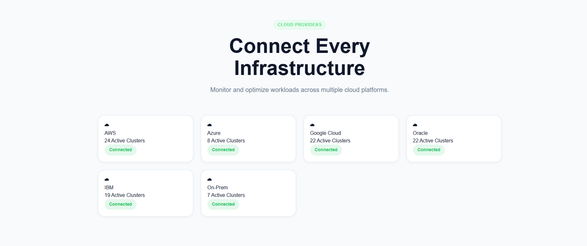
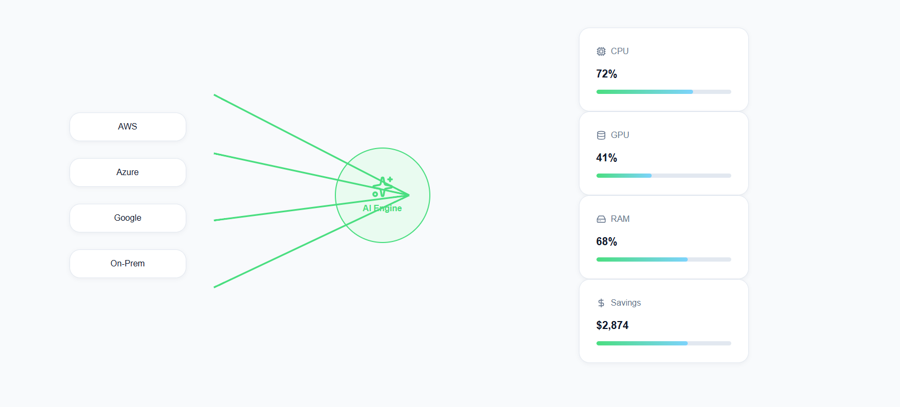
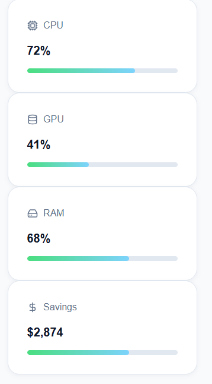
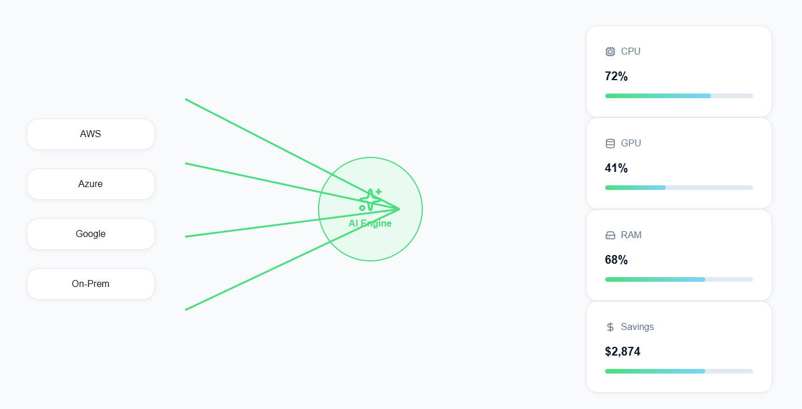
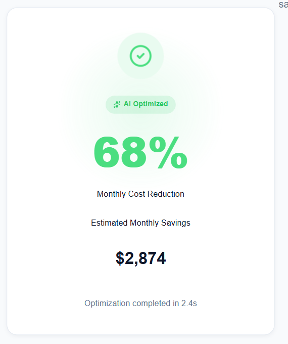

# CloudFlow AI

A modern frontend engineering challenge submission for **Atomity**.

This project reimagines the cloud infrastructure visualization shown in the challenge video (Option B: 0:45–0:55) as an interactive, scroll-driven storytelling experience.

Instead of reproducing the reference video, I interpreted the concept and designed a more product-focused experience that demonstrates cloud analysis, AI optimization, and infrastructure savings.

---

# Preview

## Cloud Providers



## Infrastructure Analysis


## Resource Metrics


## Optimization Results


## Monthly Savings


## Live Demo

https://cloudflow-ai.vercel.app/

## GitHub Repository

https://github.com/Parveen-collab/cloudflow-ai

---

# Why I Chose Option B

I selected **Option B (0:45–0:55)** because it provided more opportunities to demonstrate frontend engineering skills than Option A.

Rather than recreating the original visualization pixel-for-pixel, I focused on building an experience that tells a complete product story:

Cloud Providers

↓

Infrastructure Analysis

↓

AI Optimization

↓

Resource Metrics

↓

Optimization Results

↓

Monthly Savings

The goal was to transform a short product animation into an engaging, interactive SaaS landing page section.

---

# Features

- Scroll-driven storytelling
- Animated cloud provider cards
- Infrastructure visualization
- AI optimization engine
- Animated KPI cards
- Count-up statistics
- Optimization summary
- Responsive layout
- Accessible interactions
- Design token architecture
- API-driven content
- Cached data using TanStack Query

---

# Tech Stack
- Next.js (App Router)
- React
- TypeScript
- Framer Motion
- CSS Modules
- TanStack Query
- DummyJSON API
- Lucide React

---

# Project Architecture

src/

components/

ui/

feature/

hooks/

lib/

providers/

styles/

types/

The project separates reusable UI components from feature-specific components.

Reusable components:
- Card
- Button
- Badge
- Heading
- Section
- AnimatedCounter

Feature components:
- Cloud Providers
- Infrastructure
- Optimization

---

# Design System
The project uses design tokens instead of scattered hardcoded values.

Examples include:

- Colors
- Radius
- Shadows
- Spacing
- Typography
- Container sizes

This makes theming and future maintenance significantly easier.

---

# Animation Approach
Animations are coordinated as a single storytelling sequence rather than independent effects.

Animation timeline:

1. Cloud providers appear
2. Connection lines animate
3. AI engine activates
4. Metrics animate
5. Counters count upward
6. Optimization summary appears
7. Success state is revealed

Framer Motion is used throughout the application with reusable animation variants.

The project also respects the user's `prefers-reduced-motion` setting.

---

# Data Fetching
Data is fetched from the DummyJSON public API.

Rather than displaying product information directly, the response is transformed into cloud infrastructure metrics such as:

- CPU Usage
- GPU Usage
- RAM Usage
- Monthly Savings

This keeps UI components independent from the API structure.

---

# Caching Strategy
TanStack Query handles:

- Request caching
- Background cache management
- Retry logic
- Loading states
- Error handling

This avoids unnecessary network requests while keeping the UI responsive.

---

# Accessibility
Implemented accessibility improvements include:

- Semantic HTML
- Keyboard accessibility
- Visible focus states
- Reduced motion support
- ARIA labels
- Responsive typography

---

# Responsive Design
The application is optimized for:

- Desktop
- Tablet
- Mobile

Responsive behavior uses modern CSS techniques including:

- CSS Container Queries
- clamp()
- Logical Properties

---

# Tradeoffs
To stay within the challenge time limit, I prioritized:

- Animation quality
- Component architecture
- Performance
- Accessibility

instead of building a larger application.

The project focuses on delivering one polished interactive feature rather than multiple unfinished sections.

---

# Future Improvements
Given more time I would add:

- Real cloud infrastructure data
- Interactive network graph
- More advanced graph animations
- Performance monitoring
- Unit and integration tests

---

# Evaluation Score

| Criteria | Weight | Before | After |
|----------|--------|--------|-------|
| Code quality | 25% | 21/25 | 24/25 |
| Animation craft | 20% | 14/20 | 17/20 |
| Responsiveness | 15% | 12/15 | 14/15 |
| Modern CSS & styling | 15% | 13/15 | 15/15 |
| Data handling | 15% | 10/15 | 14/15 |
| Product thinking & docs | 10% | 8/10 | 9/10 |

**Overall: ~79/100 → ~93/100**

Key gaps addressed in the latest pass:
- All sections now consume cached API data (metrics and savings were previously hardcoded)
- Fixed `ProviderCard` importing the wrong CSS module
- Added dark/light theme toggle wired to design tokens
- Added `:has()` parent-aware styling and shared loading/error states
- Improved scroll choreography with staggered provider cards and viewport-gated engine pulse

---

# Getting Started
Install dependencies

```bash
npm install
```

Run locally

```bash
npm run dev
```

Build

```bash
npm run build
```

---

# Folder Structure
```
src/
├── app/
├── components/
│   ├── feature/
│   └── ui/
├── hooks/
├── lib/
├── providers/
├── styles/
└── types/
```

---

## Self Evaluation 

| Criteria | Weight | I Will Get |
|----------|--------|-----------------|
| **Code quality** | 25% | 25% |
| **Animation craft** | 20% | 10% |
| **Responsiveness** | 15% | 10% |
| **Modern CSS & styling** | 15% | 15% |
| **Data handling** | 15% | 15% |
| **Product thinking & docs** | 10% | 10% |

## Over all Score = 85%/100%

# Author
Parveen Kumar

Frontend Engineering Challenge Submission for Atomity